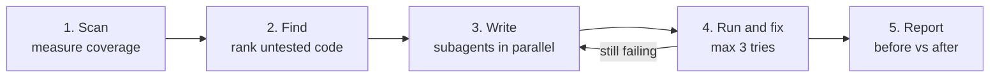

# TestGap Agent: Project Overview

**One-line pitch:** TestGap Agent finds the parts of your code that have no tests, writes tests for them, runs them, and shows a clear "before vs after" report. IBM Bob 2.0 does the thinking. Small helper scripts do the measuring.

| | |
|---|---|
| Hackathon theme | Make one developer workflow faster, easier or less error-prone |
| Workflow we picked | **Testing** |
| Main language | Python (pytest) |
| Built with | IBM Bob 2.0 (Agent mode, subagents, parallel tasks, document understanding) |

---

## 1. The problem

Most projects have a lot of code with no tests. This causes three problems:

- **Nobody knows what is untested.** Developers guess, and important code often has zero tests.
- **Writing tests is slow and boring.** So people skip it, and bugs reach users.
- **Making test data is tedious.** Tests need realistic names, emails, prices and dates. Typing these by hand takes time.

The result is low test coverage, more bugs, and code changes that are slow and risky.

---

## 2. Who it helps

- **Developers** who want tests but don't have time to write them.
- **Team leads** who want higher test coverage without stopping feature work.
- **New team members**, who can read the generated tests to learn what the code does.

---

## 3. What we are building

TestGap Agent runs the whole testing workflow in 5 steps:

| Step | What happens | Who does it |
|---|---|---|
| 1. Scan | Run the existing tests and measure coverage | Helper script |
| 2. Find | List untested functions, most important first | Helper script |
| 3. Write | Write tests for each gap, with realistic fake data | Bob subagents, in parallel |
| 4. Run and fix | Run the new tests and fix broken ones (max 3 tries) | Helper script + Bob |
| 5. Report | Show coverage before vs after, tests added, time taken, possible bugs | Helper script |

**Important rule:** TestGap Agent never changes your real code. It only adds new test files. If a test shows the code may be wrong, the tool flags it as a *possible bug* for a human to check.

---

## 4. How IBM Bob is used

| Bob feature | What we use it for |
|---|---|
| **Agent mode** | Bob runs the whole 5-step workflow by itself from one instruction |
| **Subagents** | One subagent per source file writes the tests for that file |
| **Parallel tasks** | Subagents work at the same time, which makes the run much faster |
| **Document understanding** | Bob reads the README and docs, so tests check what the code *should* do, not only what it does |

We also use Bob to **build** the tool, with a separate Bob task for each part (planning, scanner, test writer, runner, report, docs). This gives us the screenshots for the `bob_sessions/` folder.

---

## 5. What the demo will show

1. A sample project with low coverage (lots of red in the coverage report).
2. One instruction to Bob starts TestGap Agent.
3. Bob's subagents write tests for different files at the same time.
4. Tests run, and a broken test gets fixed automatically.
5. The final report: coverage up, tests added, time saved.

---

## 6. How we will measure success

These are **targets**. We will replace them with real numbers after our test runs.

| Metric | Before (expected) | Target after |
|---|---|---|
| Test coverage | about 20% | 70% or more |
| New tests added | 0 | 40+ |
| Time to write those tests | several hours by hand | under 15 minutes |
| New tests passing | n/a | 90% or more |
| Lines of real code changed by the tool | n/a | 0 |

**How we measure "time by hand":** one team member writes 5 tests by hand and times it. We multiply that average by the number of tests the tool wrote.

---

## 7. What we are NOT building (for now)

- Finding flaky tests (tests that fail randomly). This is a future idea.
- Support for languages other than Python.
- A web dashboard. The report is a Markdown file.
- Fixing bugs in the real code. We only flag them.

---

## 8. Tech we will use

- **Python 3.11+**
- **pytest** runs the tests
- **pytest-cov / coverage.py** measures which lines are tested
- **Faker** creates realistic fake data
- **IBM Bob 2.0** does the AI work

---

## 9. Hackathon deliverables

- [ ] Video demo (3–5 min) with before vs after numbers
- [ ] Problem & solution statement
- [ ] "How we used IBM Bob" write-up
- [ ] Code repo with a good README
- [ ] Repo set to Public (no secrets anywhere in the history)
- [ ] `bob_sessions/` folder with PNG screenshots from every team member

---

## 10. Next steps

1. Create the repo from the hackathon template.
2. Pick or build the sample project (5–10 Python files, only 1–2 tests).
3. Run coverage once and write down the "before" number.
4. Start Bob Task 1: planning.

**Related documents:** `02_BRD_TRD.md` (requirements) and `03_architecture.md` (how it is built).
