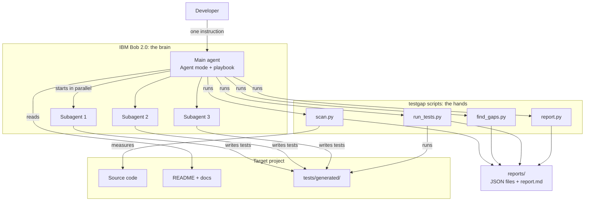
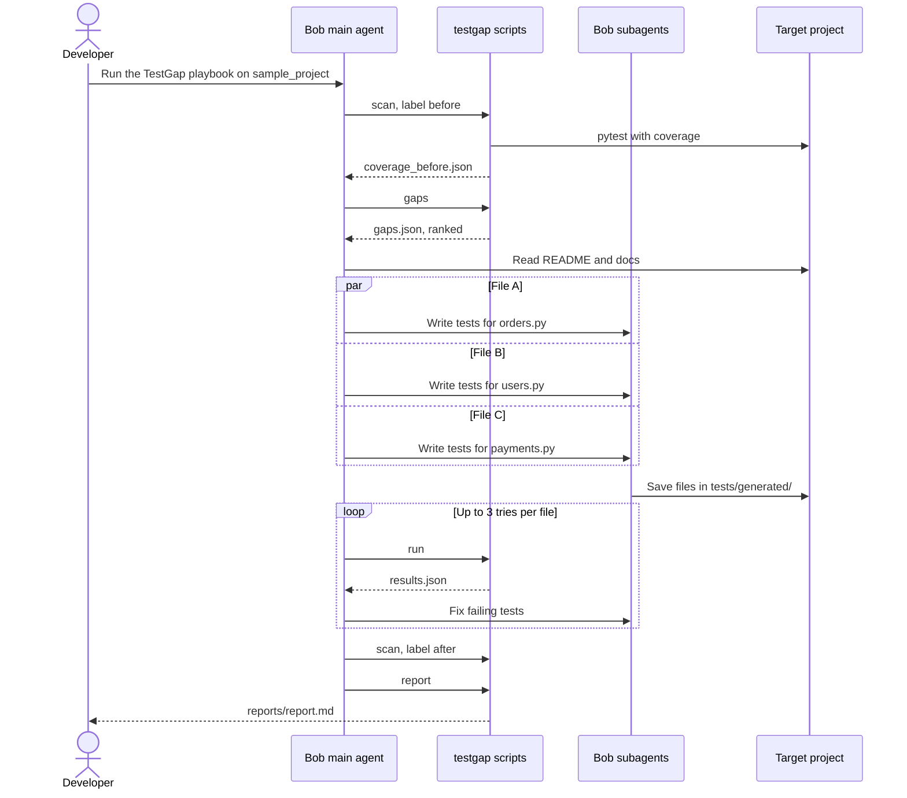
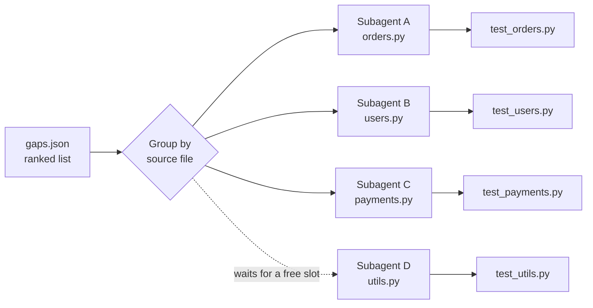

# TestGap Agent: Architecture

This file explains how TestGap Agent is built. The diagrams use Mermaid, which GitHub shows as pictures.

---

## 1. The big idea: brain + hands

TestGap Agent has two parts:

- **The brain: IBM Bob 2.0.** It reads code and docs, writes tests, fixes broken tests and decides what to do next.
- **The hands: small Python scripts (`testgap`).** They do exact jobs that must give the same answer every time: measure coverage, find gaps, run tests, count numbers.

**Why split it this way?** AI is great at writing tests, but the numbers we show judges must be exact and trustworthy. Scripts give real, repeatable numbers. Bob does the creative work.

---

## 2. Architecture diagram



---

## 3. Components

| Component | Type | Job | Input | Output |
|---|---|---|---|---|
| Playbook | Markdown instructions | Tells Bob the steps and the rules | n/a | n/a |
| Main agent | Bob, Agent mode | Runs the workflow and starts subagents | Playbook | Decisions and commands |
| Subagents | Bob subagents | Each writes tests for one source file | Gaps + source + docs | `test_<module>.py` |
| `scan.py` | Script | Runs pytest with coverage | Project folder | `coverage_<label>.json`, metrics |
| `find_gaps.py` | Script | Finds and ranks untested functions | Coverage JSON + source code | `gaps.json` |
| `run_tests.py` | Script | Runs the tests and collects results | Project folder | `junit.xml`, `results.json` |
| `report.py` | Script | Builds the final report and checks `git diff` | All JSON files | `report.md` |
| `cli.py` | Script | One entry point: `python -m testgap <command>` | Command arguments | Calls the scripts above |

---

## 4. Workflow step by step



**In plain words:**

1. **Scan.** Bob runs `scan`. The script runs the existing tests and saves which lines are tested.
2. **Find.** Bob runs `gaps`. The script finds untested functions and ranks them.
3. **Read.** Bob reads the README and docs to understand what the code *should* do.
4. **Write.** Bob starts one subagent per source file. They write tests at the same time.
5. **Run and fix.** Bob runs all tests. If a generated test fails, Bob finds out why and fixes the test (max 3 tries).
6. **Scan again.** Bob measures the "after" coverage.
7. **Report.** Bob builds the report with all the numbers.

---

## 5. How work is split between subagents



- **One subagent per source file.** Each subagent writes its own test file, so two subagents never edit the same file.
- **Max 3 at a time** (you can change this). Extra files wait until a slot is free.
- **Each subagent gets:** the source file, its list of gaps, the related docs, the existing tests (to copy their style) and the test-writing rules.

---

## 6. Data files (examples)

The steps talk to each other through small JSON files. This makes each step easy to test, rerun and debug on its own.

**`gaps.json`**

```json
{
  "project": "sample_project",
  "coverage_percent": 22.4,
  "gaps": [
    {
      "id": "G-001",
      "file": "app/orders.py",
      "function": "calculate_total",
      "start_line": 12,
      "end_line": 34,
      "missing_lines": [15, 16, 20, 21, 22, 23, 27, 28, 30],
      "score": 28,
      "priority": "high",
      "reason": "Public function, 9 untested lines, named in README"
    }
  ]
}
```

**`results.json`**

```json
{
  "total": 52,
  "passed": 48,
  "failed": 1,
  "xfailed": 2,
  "errors": 1,
  "failures": [
    {
      "test": "tests/generated/test_orders.py::test_apply_discount_over_100_percent",
      "file": "tests/generated/test_orders.py",
      "message": "AssertionError: expected ValueError"
    }
  ]
}
```

**`metrics.json`** (example values)

```json
{
  "project": "sample_project",
  "started_at": "2026-10-02T10:00:05",
  "finished_at": "2026-10-02T10:09:41",
  "coverage_before": 22.4,
  "coverage_after": 78.9,
  "tests_before": 4,
  "tests_after": 56,
  "possible_bugs": 2,
  "source_files_changed": 0
}
```

**`report.md`** (example of what the final report looks like)

```markdown
# TestGap Report: sample_project

|                    | Before | After |
|--------------------|--------|-------|
| Coverage           | 22.4%  | 78.9% |
| Tests              | 4      | 56    |

- Tests added: 52 (48 passing, 2 possible bugs, 2 could not be fixed)
- Tool run time: 9 min 36 s
- Estimated time by hand: 8.7 hours (52 tests × 10 min, from our baseline test)
- Real code changed: 0 files (checked with git diff)

## Possible bugs
1. orders.apply_discount accepts a discount over 100%. The README says the max is 100%.
```

---

## 7. Folder structure

```
testgap-agent/
├── bob_sessions/                 # Bob task screenshots (PNG)
├── docs/
│   ├── 01_project_overview.md
│   ├── 02_BRD_TRD.md
│   └── 03_architecture.md
├── playbook/
│   └── TESTGAP_PLAYBOOK.md       # instructions Bob follows
├── src/
│   └── testgap/
│       ├── __init__.py
│       ├── __main__.py           # lets you run: python -m testgap
│       ├── cli.py
│       ├── scan.py
│       ├── find_gaps.py
│       ├── run_tests.py
│       └── report.py
├── sample_project/               # demo app with few tests
│   ├── app/
│   ├── docs/
│   ├── README.md
│   └── tests/
│       ├── test_basic.py         # the few tests it already had
│       └── generated/            # tests written by TestGap Agent
├── reports/                      # output (JSON files + report.md)
├── tests/                        # tests for TestGap itself
├── pyproject.toml
├── requirements.txt
├── .env.example
├── .gitignore
├── .bobignore
└── README.md
```

---

## 8. The Bob playbook (first draft)

This is the instruction file Bob follows in Agent mode. Save it as `playbook/TESTGAP_PLAYBOOK.md`.

```markdown
# TestGap Playbook (for Bob, Agent mode)

Goal: raise the test coverage of <PROJECT> without changing any real code.

## Steps
1. Run: python -m testgap scan --project <PROJECT> --label before
2. Run: python -m testgap gaps --project <PROJECT>
3. Read reports/gaps.json, the project README and the docs/ folder.
4. Group the gaps by source file. Start one subagent per file (max 3 at once).
   Give each subagent: the source file, its gaps, the related docs,
   the existing tests, and the Rules below.
5. When all subagents finish, run: python -m testgap run --project <PROJECT>
6. For each failing generated test, find out why and fix the TEST.
   Max 3 tries per file. If it still fails, mark it
   @pytest.mark.skip(reason="Could not fix automatically").
7. Run: python -m testgap scan --project <PROJECT> --label after
8. Run: python -m testgap report
9. Show me reports/report.md.

## Rules for writing tests
- Only create or edit files in <PROJECT>/tests/generated/.
- Never edit source code.
- Use pytest. One idea per test. Name tests test_<function>_<situation>.
- Use Faker for test data, with Faker.seed(1234) so the data is the same every run.
- Test normal cases, edge cases (empty, zero, negative, very large) and error cases.
- Check what the docs say the code SHOULD do.
- If the code disagrees with the docs, do NOT change the test to match the code.
  Mark it @pytest.mark.xfail(reason="Possible bug: <short reason>").
- Never put real secrets or real personal data in tests.
```

---

## 9. Safety rules (guardrails)

| Rule | How it is enforced |
|---|---|
| Never change real code | Playbook rule + `report.py` checks `git diff` on source files and shows the count |
| Only write in one folder | Subagents write only to `tests/generated/` |
| Don't hide bugs | Tests that disagree with the docs become `xfail` with "Possible bug", listed in the report |
| Don't loop forever | Max 3 fix tries per file |
| Don't create flaky tests | Faker uses a fixed seed; no real time, network or random values in tests |
| No secrets | Scripts need no keys; `.env` is git-ignored; `.bobignore` is in place |

---

## 10. When things go wrong

| Problem | What happens |
|---|---|
| pytest or coverage not installed | Script stops with a clear message: "Run pip install -r requirements.txt" |
| Existing tests already fail before we start | Warning printed and shown in the report; the tool continues |
| No gaps found | Report says "Coverage is already high" and stops |
| A generated test file has a syntax error | `run` shows a collection error; Bob fixes it (counts as one try) |
| A test still fails after 3 tries | Marked `skip` with a reason and listed in the report |
| A source file was changed by mistake | Report shows a warning with the file name; revert it with `git checkout` |

---

## 11. Why we made these choices

- **Scripts for numbers, Bob for thinking.** The judges can trust the numbers.
- **One subagent per file.** No two subagents fight over the same file.
- **JSON files between steps.** Each step can be tested and rerun alone, which makes debugging easy.
- **Fixed Faker seed.** Our tool does not create new flaky tests.
- **Only writes to `tests/generated/`.** Easy to review, easy to delete, safe for the real code.
- **`xfail` for possible bugs.** The test suite stays green, but the bug stays visible instead of hidden.

---

## 12. Future ideas

- **Flaky test finder:** run each test 10 times and flag the ones whose result changes.
- **GitHub Action:** run TestGap on every pull request and comment the coverage change.
- **JavaScript/TypeScript support** with Jest.
- **Mutation testing** (for example with `mutmut`) to check that the new tests are strong, not just present.
