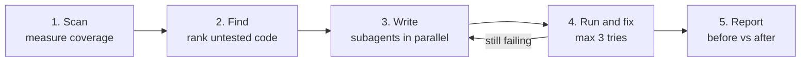

# TestGap Agent

**TestGap Agent finds the code in a Python project that has no tests, writes tests for it, runs and fixes them, and produces a before-vs-after coverage report — from one instruction to IBM Bob 2.0.**

| | |
|---|---|
| Hackathon theme | Make one developer workflow faster, easier or less error-prone |
| Workflow | **Testing** |
| Language | Python 3.11+ / pytest |
| Built with | IBM Bob 2.0 — Agent mode, custom mode, parallel subagents, document understanding |

---

## Results (real run on the sample project)

One instruction — *"Run the TestGap playbook on sample_project."* — produced these numbers. The full output is committed in [`reports/report.md`](reports/report.md) and [`sample_project/tests/generated/`](sample_project/tests/generated/).

| | Before | After |
|---|---|---|
| Test coverage | 21.5% | **100.0%** |
| Tests | 4 | **165** |
| Tests added by TestGap | — | **161** |
| Generated tests passing | — | **160 / 161 (99.4%)** — the other one is a flagged possible bug |
| Possible bugs found | — | **1** (`apply_discount` accepts discounts over 100%) |
| Real code changed | — | **0 files** (checked with `git status`) |
| Time taken | **~72.5 hours** by hand (161 tests × 27 min) | **5 min 41 s** with TestGap |

The 27 minutes per test is **measured, not guessed**: one team member wrote 5 tests by hand to the same quality bar and timed each one — see [`docs/baseline_timing.md`](docs/baseline_timing.md).

---

## The problem

Most projects have a lot of code with no tests:

- **Nobody knows what is untested.** Developers guess, and important code often has zero tests.
- **Writing tests is slow.** Our own measurement: 27 minutes per good test. So people skip it, and bugs reach users.
- **Test data is tedious.** Tests need realistic names, emails and prices, typed by hand.

## The solution

TestGap Agent runs the whole testing workflow in 5 steps:



| Step | What happens | Who does it |
|---|---|---|
| 1. Scan | Run the existing tests and measure coverage | `python -m testgap scan` |
| 2. Find | Map uncovered lines to functions (AST) and rank them by priority | `python -m testgap gaps` |
| 3. Write | Write tests for each gap, with seeded Faker data, checked against the docs | Bob subagents, in parallel |
| 4. Run and fix | Run everything; Bob fixes broken tests (max 3 tries per file) | `python -m testgap run` + Bob |
| 5. Report | Coverage before vs after, tests added, pass rate, time saved, possible bugs | `python -m testgap report` |

**TestGap never changes your real code.** It only adds files under `tests/generated/` and `reports/`. When the code disagrees with its documentation, the test is marked `xfail` with a *"Possible bug: …"* reason for a human to review — the test is never bent to match the code.

The design is split in two:

- **The hands — the `testgap` Python package** ([`src/testgap/`](src/testgap/)): deterministic scripts that measure, rank, run and report. Same input → byte-identical JSON. Covered by 215 unit tests.
- **The brain — IBM Bob 2.0** following [`playbook/TESTGAP_PLAYBOOK.md`](playbook/TESTGAP_PLAYBOOK.md): reads the docs, writes the tests, fixes failures and judges possible bugs.

More detail: [project overview](docs/01_project_overview.md) · [requirements (BRD/TRD)](docs/02_BRD_TRD.md) · [architecture](docs/03_architecture.md) · [implementation plan](testgap-implementation-plan.md)

---

## How we used IBM Bob

| Bob feature | How TestGap uses it |
|---|---|
| **Agent mode** | Bob runs all steps end to end — clean, scan, gaps, write, run, fix loop, rescan, report — from a single instruction. No `testgap` command is typed by hand. |
| **Custom mode** | The `testgap-writer` mode in [`.bob/custom_modes.yaml`](.bob/custom_modes.yaml) holds the role and points Bob at the playbook, so the whole workflow is one instruction. |
| **Tool-level safety (`fileRegex`)** | The mode's edit permission is restricted to `sample_project/tests/generated/test_*.py`. Bob *cannot* edit real source code — the guarantee is enforced by Bob, not just requested — and `report` double-checks it with `git status`. |
| **Subagents + parallel tasks** | Bob groups the gaps by source file and calls `spawn_subagent` once per file, several in the same turn so they run in parallel. Each subagent gets a self-contained brief: source file, its gaps, the docs, the existing test style and the test-writing rules. |
| **Document understanding** | Bob reads `README.md` and `docs/business_rules.md` so tests check what the code *should* do. That is how it caught the `apply_discount` bug: the docs say a discount can never exceed 100%, but the code accepts 150% and returns a negative price. |

How we worked out the subagent recipe (parameters, parallelism, custom modes, `fileRegex`) is recorded in [`playbook/BOB_NOTES.md`](playbook/BOB_NOTES.md).

We also used Bob to **build** the tool, one Bob task per milestone: planning, scaffold, core scripts, sample project, playbook and the end-to-end run. Screenshots are in [`bob_sessions/`](bob_sessions/).

---

## Setup

Requires Python 3.11+ and git.

```bash
git clone https://github.com/ShreyJoshi74/testgap-agent.git
cd testgap-agent
python -m venv .venv
source .venv/bin/activate          # Windows: .venv\Scripts\activate
pip install -r requirements.txt    # pytest, pytest-cov, coverage, Faker, pytest-timeout
pip install -e .                   # makes "python -m testgap" work
python -m testgap --help
```

No API keys are needed by the helper scripts.

Run the tool's own unit tests:

```bash
python -m pytest
```

## Running the demo

1. Start from a clean tree: `git status` should show nothing to commit.
2. Reset any previous output:
   ```bash
   python -m testgap clean --project sample_project
   ```
3. Open the repo in IBM Bob 2.0, switch to the **TestGap Writer** mode and send:
   > **Run the TestGap playbook on sample_project.**
4. Bob finishes by showing [`reports/report.md`](reports/report.md).

The individual commands (normally run by Bob):

| Step | Command |
|---|---|
| Clean | `python -m testgap clean --project sample_project` |
| Scan before | `python -m testgap scan --project sample_project --label before` |
| Find gaps | `python -m testgap gaps --project sample_project` |
| Run tests | `python -m testgap run --project sample_project` |
| Scan after | `python -m testgap scan --project sample_project --label after` |
| Report | `python -m testgap report --minutes-per-test 27` |

### The sample project

[`sample_project/`](sample_project/) is **ShopLite**, a small pure-Python shop backend (orders, users, payments, inventory, utils) with only 4 tests to begin with. Its [`docs/business_rules.md`](sample_project/docs/business_rules.md) states the rules the code must follow — including one the code deliberately breaks.

---

## Repository layout

```
src/testgap/            the testgap package: cli, scan, find_gaps, run_tests, report, clean, common
tests/                  unit tests for the testgap package (215)
playbook/               TESTGAP_PLAYBOOK.md (Bob's instructions) and BOB_NOTES.md (Bob recipe)
.bob/custom_modes.yaml  the testgap-writer Bob mode
sample_project/         ShopLite demo app; tests/generated/ holds the tests TestGap wrote
reports/                output of the final run: report.md plus the JSON artefacts
docs/                   overview, requirements, architecture, manual-timing baseline
bob_sessions/           screenshots of the Bob sessions used to build the project
```

## Limitations

- Python + pytest projects only.
- The tool flags possible bugs; it never fixes source code.
- Test quality depends on the project's docs: the clearer the business rules, the better the tests and bug detection.

---

## 🔒 Security

- `.env` is in `.gitignore` (verify with `git check-ignore -v .env`); `.env.example` holds placeholders only.
- `.bobignore` stops Bob from reading credential files.
- Generated tests use Faker data only — no real personal data or secrets.
- See [SECURITY.md](SECURITY.MD) for the full guidelines.

### Before every commit

- [ ] Reviewed `git diff` for sensitive data
- [ ] No hardcoded API keys or passwords
- [ ] `.env` file is NOT in staged changes
- [ ] No files with "credential" or "secret" in name
- [ ] Used environment variables for all credentials
