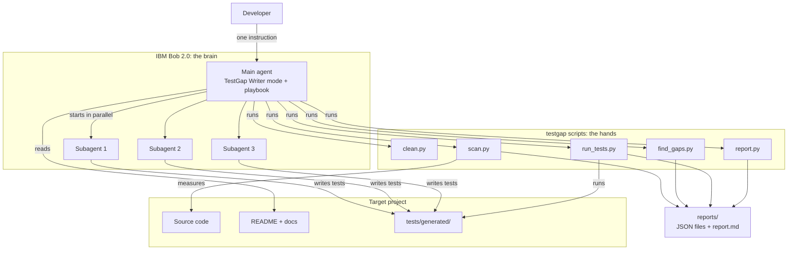
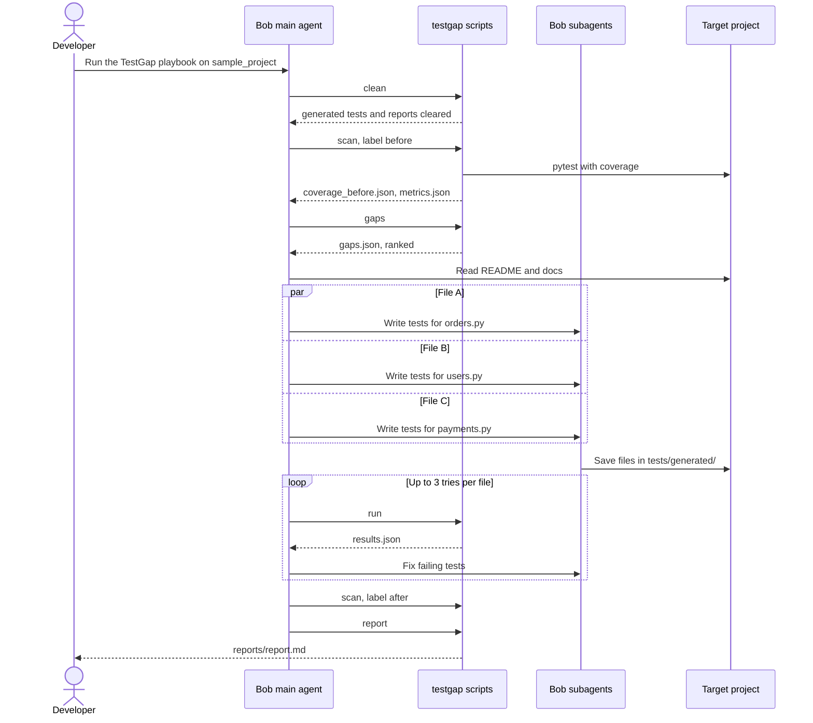
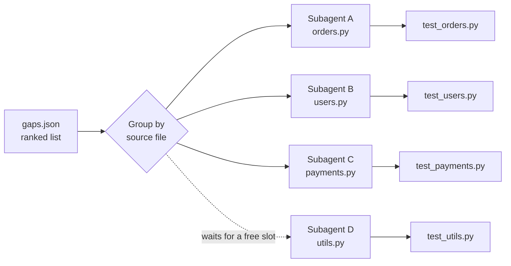

# TestGap Agent: Architecture

This file explains how TestGap Agent is built. The diagrams use Mermaid, which GitHub shows as pictures.

---

## 1. The big idea: brain + hands

TestGap Agent has two parts:

- **The brain: IBM Bob 2.0.** It reads code and docs, writes tests, fixes broken tests and decides what to do next.
- **The hands: small Python scripts (`testgap`).** They do exact jobs that must give the same answer every time: measure coverage, find gaps, run tests, count numbers.

**Why split it this way?** AI is great at writing tests, but the numbers we show judges must be exact and trustworthy. Scripts give real, repeatable numbers. Bob does the creative work.

---

## 2. Architecture diagram



---

## 3. Components

| Component | Type | Job | Input | Output |
|---|---|---|---|---|
| Playbook | Markdown instructions | Tells Bob the steps and the rules | n/a | n/a |
| Main agent | Bob, TestGap Writer mode | Runs the workflow and starts subagents | Playbook | Decisions and commands |
| Subagents | Bob subagents | Each writes tests for one source file | Gaps + source + docs | `test_<module>.py` |
| `common.py` | Shared helpers | Subprocess runner, JSON I/O, dep check, path helpers | n/a | n/a |
| `clean.py` | Script | Deletes generated tests and report files before a run | Project folder | n/a |
| `scan.py` | Script | Runs pytest with coverage; records `dirty_before` on the first scan | Project folder | `coverage_<label>.json`, `junit_<label>.xml`, metrics |
| `find_gaps.py` | Script | Finds and ranks untested functions | Coverage JSON + source code | `gaps.json` |
| `run_tests.py` | Script | Runs the tests and collects results | Project folder | `junit.xml`, `results.json`, metrics |
| `report.py` | Script | Builds the final report; checks `git status`; sets `finished_at` | All JSON files | `report.md`, metrics |
| `cli.py` | Script | One entry point: `python -m testgap <command>` | Command arguments | Calls the scripts above |

---

## 4. Workflow step by step



**In plain words:**

0. **Clean.** Bob runs `clean`. The script deletes any leftover generated test files and report files so the run starts fresh.
1. **Scan.** Bob runs `scan`. The script runs the existing tests and saves which lines are tested. It also records which files were already modified (`dirty_before`) so the change check at the end is accurate.
2. **Find.** Bob runs `gaps`. The script finds untested functions and ranks them.
3. **Read.** Bob reads the README and docs to understand what the code *should* do.
4. **Write.** Bob starts one subagent per source file. They write tests at the same time.
5. **Run and fix.** Bob runs all tests. If a generated test fails, Bob finds out why and fixes the test (max 3 tries).
6. **Scan again.** Bob measures the "after" coverage.
7. **Report.** Bob builds the report with all the numbers.

---

## 5. How work is split between subagents



- **One subagent per source file.** Each subagent writes its own test file, so two subagents never edit the same file.
- **Max 3–4 at a time** (you can change this). Extra files wait until a slot is free.
- **Each subagent gets:** the source file, its list of gaps, the related docs, the existing tests (to copy their style) and the test-writing rules.

---

## 6. Data files

The steps talk to each other through small JSON files in `reports/`. This makes each step easy to test, rerun and debug on its own.

### `gaps.json`

```json
{
  "project": "sample_project",
  "src": "app",
  "coverage_label": "before",
  "coverage_percent": 22.4,
  "unattributed_missing_lines": 3,
  "gaps": [
    {
      "id": "G-001",
      "file": "app/orders.py",
      "function": "calculate_total",
      "start_line": 12,
      "end_line": 34,
      "missing_lines": [15, 16, 20, 21, 22, 23, 27, 28, 30],
      "score": 28,
      "priority": "high",
      "reason": "Public function, 9 untested lines, named in README"
    }
  ]
}
```

- `file` always uses `/` separators, relative to the project folder.
- Methods are named `ClassName.method`.
- `unattributed_missing_lines`: count of missing lines that couldn't be mapped to a function.

### `results.json`

```json
{
  "total": 56,
  "passed": 52,
  "failed": 1,
  "errors": 0,
  "xfailed": 2,
  "skipped": 1,
  "generated": {
    "total": 52,
    "passed": 48,
    "failed": 1,
    "errors": 0,
    "xfailed": 2,
    "skipped": 1,
    "pass_rate": 0.923
  },
  "failures": [
    {
      "test": "tests/generated/test_orders.py::test_apply_discount_over_100_percent",
      "file": "tests/generated/test_orders.py",
      "kind": "failed",
      "message": "AssertionError: expected ValueError"
    }
  ],
  "failures_by_file": { "tests/generated/test_orders.py": 1 },
  "xfails": [
    {
      "test": "tests/generated/test_orders.py::test_apply_discount_rejects_over_100",
      "file": "tests/generated/test_orders.py",
      "reason": "Possible bug: README says max discount is 100%, code accepts 150%"
    }
  ],
  "skips": [
    {
      "test": "tests/generated/test_users.py::test_register_user_duplicate_email",
      "file": "tests/generated/test_users.py",
      "reason": "Could not fix automatically: depends on database state"
    }
  ]
}
```

**Pass rate** is defined as `generated.passed / generated.total`. `xfailed`, `skipped`, `failed` and `errors` all count as *not passing*.

### `metrics.json`

```json
{
  "project": "sample_project",
  "src": "app",
  "started_at": "2026-10-02T10:00:05+00:00",
  "finished_at": "2026-10-02T10:09:41+00:00",
  "run_seconds": 576,
  "dirty_before": [],
  "coverage_before": 22.4,
  "coverage_after": 78.9,
  "tests_before": 4,
  "tests_after": 56,
  "existing_tests_failing_before": 0,
  "generated_total": 52,
  "generated_passed": 48,
  "pass_rate": 0.923,
  "possible_bugs": 2,
  "could_not_fix": 1,
  "minutes_per_test": 27,
  "minutes_per_test_measured": true,
  "estimated_manual_hours": 23.4,
  "files_changed": [],
  "source_files_changed": 0
}
```

| Field | Written by |
|---|---|
| `project`, `src`, `started_at`, `dirty_before`, `coverage_before`, `tests_before`, `existing_tests_failing_before` | `scan --label before` |
| `coverage_after`, `tests_after` | `scan --label after` |
| `generated_*`, `pass_rate`, `possible_bugs`, `could_not_fix` | `run` |
| `finished_at`, `run_seconds`, `minutes_per_test*`, `estimated_manual_hours`, `files_changed`, `source_files_changed` | `report` |

### `report.md` (example)

```markdown
# TestGap Report: sample_project

|                    | Before | After |
|--------------------|--------|-------|
| Coverage           | 22.4%  | 78.9% |
| Tests              | 4      | 56    |

- Tests added: 52 (48 passing, 2 possible bugs, 1 could not be fixed, 1 still failing)
- Generated pass rate: 92.3%
- Tool run time: 9m 36s
- Estimated time by hand: 23.4 hours (52 tests × 27 min, from our baseline test)
- Real code changed: 0 files (checked with git)

## Possible bugs
1. `tests/generated/test_orders.py::test_apply_discount_rejects_over_100` — Possible bug: README says max discount is 100%, code accepts 150%
```

---

## 7. Folder structure

```
testgap-agent/
├── .bob/
│   └── custom_modes.yaml         # TestGap Writer mode definition
├── bob_sessions/                 # Bob task screenshots (PNG)
├── docs/
│   ├── 01_project_overview.md
│   ├── 02_BRD_TRD.md
│   ├── 03_architecture.md
│   └── baseline_timing.md        # measured minutes-per-test for the report
├── playbook/
│   ├── BOB_NOTES.md              # spike notes on Bob 2.0 subagents
│   └── TESTGAP_PLAYBOOK.md       # step-by-step instructions Bob follows
├── src/
│   └── testgap/
│       ├── __init__.py
│       ├── __main__.py           # lets you run: python -m testgap
│       ├── cli.py                # argument parser and command dispatcher
│       ├── common.py             # shared helpers (subprocess, JSON, dep check)
│       ├── clean.py              # delete generated tests and reports
│       ├── scan.py               # pytest + coverage; records dirty_before
│       ├── find_gaps.py          # AST gap finder and ranker
│       ├── run_tests.py          # JUnit XML parser; writes results.json
│       └── report.py             # report builder; git status check
├── sample_project/               # demo app with few tests
│   ├── app/
│   ├── docs/
│   ├── README.md
│   └── tests/
│       ├── test_basic.py         # the few tests it already had
│       └── generated/            # tests written by TestGap Agent
│           ├── __init__.py
│           └── conftest.py       # faker_seed fixture (seed = 1234)
├── reports/                      # output (JSON files + report.md)
├── tests/                        # unit tests for the testgap scripts
├── pyproject.toml
├── requirements.txt
├── .env.example
├── .gitignore
├── .bobignore
└── README.md
```

---

## 8. The Bob playbook

The full playbook is in `playbook/TESTGAP_PLAYBOOK.md`. It is loaded automatically when you switch to the **TestGap Writer** mode (defined in `.bob/custom_modes.yaml`).

The playbook steps in brief:

| Step | Command / action |
|---|---|
| 0 · Clean | `python -m testgap clean --project <PROJECT>` |
| 1 · Scan before | `python -m testgap scan --project <PROJECT> --label before` |
| 2 · Find gaps | `python -m testgap gaps --project <PROJECT>` — stop here if no gaps |
| 3 · Read | Read `reports/gaps.json`, `<PROJECT>/README.md`, `<PROJECT>/docs/` |
| 4 · Write | Spawn one subagent per source file (max 3–4 at once, all in the same turn) |
| 5 · Run | `python -m testgap run --project <PROJECT>` |
| 6 · Fix loop | Fix failing generated tests, max 3 tries per file; mark remaining `skip` |
| 7 · Scan after | `python -m testgap scan --project <PROJECT> --label after` |
| 8 · Report | `python -m testgap report --minutes-per-test 27` |
| 9 · Show | Display `reports/report.md` |

---

## 9. Safety rules (guardrails)

| Rule | How it is enforced |
|---|---|
| Never change real code | `fileRegex` in the custom mode blocks edits outside `tests/generated/` and `reports/` at the tool level (not just by instruction) |
| Only write in one folder | Subagents write only to `tests/generated/` |
| Don't hide bugs | Tests that disagree with the docs become `xfail` with "Possible bug", listed in the report |
| Don't loop forever | Max 3 fix tries per file |
| Don't create flaky tests | The `faker_seed` fixture in `tests/generated/conftest.py` sets seed 1234; no real time, network or random values in tests |
| No secrets | Scripts need no keys; `.env` is git-ignored; `.bobignore` is in place |
| Change check covers whole repo | `scan --label before` records all dirty paths in `dirty_before`; `report` runs `git status --porcelain` and filters out the allowlist and `dirty_before` |

---

## 10. When things go wrong

| Problem | What happens |
|---|---|
| pytest or coverage not installed | Script stops with a clear message: "Run pip install -r requirements.txt" |
| Existing tests already fail before we start | Warning printed; count stored in `existing_tests_failing_before` in metrics; tool continues |
| No gaps found | `gaps` prints "Coverage is already high — no gaps found"; playbook skips to step 8 |
| A generated test file has a syntax error | `run` shows a collection error; counts as one fix try |
| A test still fails after 3 tries | Marked `skip` with a reason and listed in the report under "Could not fix automatically" |
| A source file was changed by mistake | `report` shows a warning with the file name; revert with `git checkout -- <file>` |
| A test hangs | `pytest-timeout` caps each test at 30 s; the subprocess has a 600 s wall-clock limit |

---

## 11. Why we made these choices

- **Scripts for numbers, Bob for thinking.** The judges can trust the numbers.
- **`common.py` for shared logic.** Subprocess helper, JSON I/O, and dependency check live in one place so every script behaves the same way.
- **`clean` as step 0.** Ensures every run is reproducible and previous artefacts don't pollute results.
- **`dirty_before` snapshot.** `scan --label before` records which files were already modified before the run, so `report` can tell the difference between pre-existing changes and new ones.
- **`git status --porcelain` instead of `git diff`.** Catches new files as well as edits, and works even when the repo has staged changes.
- **`faker_seed` fixture instead of `Faker.seed()`.** The pytest-faker plugin's `faker` fixture is reseeded per test via `faker_seed`; calling `Faker.seed()` at module level would not reseed between tests.
- **`finished_at` set by `report`.** Run time must cover the whole workflow including the fix loop, so it can only be measured when `report` runs last.
- **One subagent per file.** No two subagents fight over the same file.
- **JSON files between steps.** Each step can be tested and rerun alone, which makes debugging easy.
- **`xfail` for possible bugs.** The test suite stays green, but the bug stays visible instead of hidden.
- **Custom Bob mode with `fileRegex`.** FR-12 ("never edit real code") is enforced at the tool level, not just by instruction.

---

## 12. Future ideas

- **Flaky test finder:** run each test 10 times and flag the ones whose result changes.
- **GitHub Action:** run TestGap on every pull request and comment the coverage change.
- **JavaScript/TypeScript support** with Jest.
- **Mutation testing** (for example with `mutmut`) to check that the new tests are strong, not just present.
